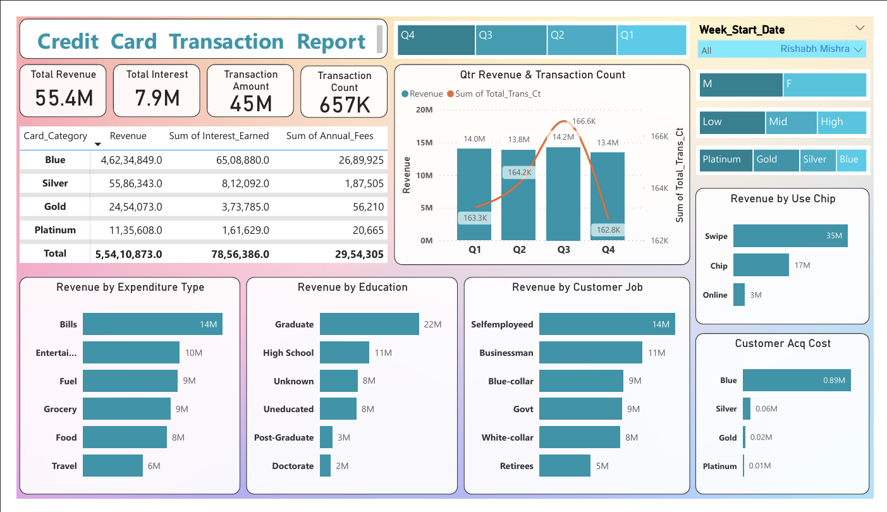
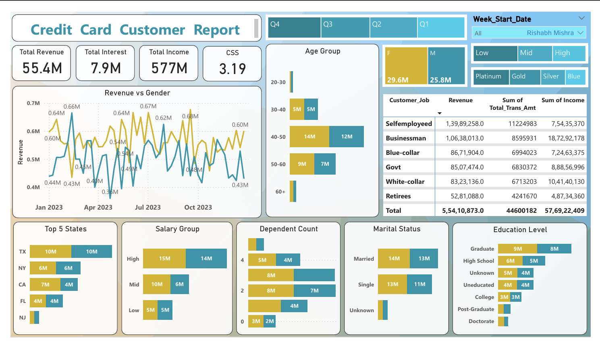

# 💳 Credit Card Dashboard Project

## An interactive Power BI dashboard to explore customer spending, card usage, and revenue trends based on credit card transaction data.

## 🔍 Key Features

- Visualized revenue, interest, and transaction data from 65K+ records
- Filtered insights by card type, job, income, age group, and education
- Built using Power BI, Excel (for cleaning), and basic SQL (for analysis)

## 📊 Tools Used

- Power BI  
- Excel  
- SQL (basic queries)

## 📈 Insights Gained

- Blue card is most widely used  
- High income and graduate users contribute the most revenue  
- Swipe transactions dominate chip usage

## 📷 Sample Dashboards

